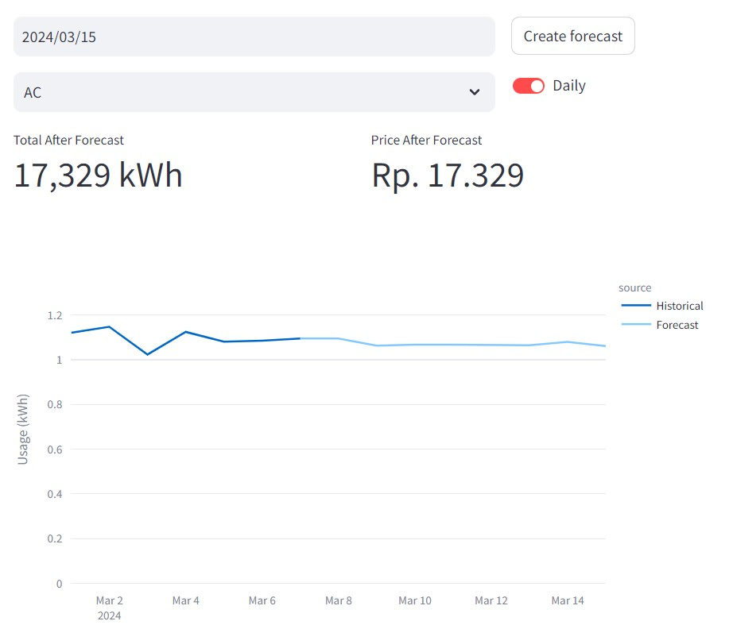

<link href="https://fonts.googleapis.com/css2?family=Material+Symbols+Outlined" rel="stylesheet" />

# Mukhlas Adib Rasyidy

{ .circle-photo }

{{ icon("person_check") }} Professional ML/AI Engineer and Consultant

{{ icon("lab_research") }} Passionate in doing research and writing

{{ icon("history_edu") }} Loves teaching about AI

{{ icon("diversity_1") }} Long leadership experience

## Edge AI System for Real-time CCTV Analysis for High-level Safety System  

Years of experience in building real-time CCTV analysis at edge with Python. Some points of this project is as follow:

- Featured with object detection, segmentation, classification, etc
- Deployment on edge device with NVIDIA GPU (Jetson)
- Integration with IoT platform in the Cloud for deployment and monitoring
- Hard-level performance optimization, from the ML models until the application code/algorithms
- Replacing more than 50% of human involvement!

## MLOps Pipeline for Computer Vision Projects

Making MLOps pipeline for computer vision tasks is not obvious. I have experienced building and maintaining MLOps pipeline from zero to production. Some points for this project are:

- End-to-end pipeline from data aggregation, annotation, dataset management, until model deployment
- Model performance monitoring in the cloud
- Research on dataset optimization
- Model and application level evaluation & CI pipeline
- In-house dashboard to operate the platform

## Training Diffusion XL LoRa for Object-specific Image Generation

One of the strength of using open-source image generation model is the ability to customize the model capability. Customly trained diffusion models is usually done to make a model that can produce images of specific person, object, animal, style, etc.

My experience in fine-tuning diffusion models starts from data collection, annotation (WD tagger models), data preparation, training (Kohya SS), and evaluation.

## Customized Open-Source-based Image Generation with Diffusion Models

Using ComfyUI, I am experienced in building customized image generation pipeline with open-source diffusion/flux model. I am able to create/edit images with various techniques such as:

- Advanced customized image generarion with Stable Diffusion and Flux
- Concept injection with LoRa
- Concept injection with textual inversion
- Editing with inpainting (differential diffusion)
- Concept injection in zero-shot way with IPAdapter
- Video generation with WAN models

## PyStream Pipeline: Real-time Python Data Pipeline Framework

An open-source python library that you can use to build a real-time data pipeline in Python. This library is focused on easiness of building multi-threaded data processing pipeline without having user to deal with data synchronization, thread management, and profiling manually. 

Some points in this project are:

- This project is made with high-quality code standard 
- Have unit tests with [PyTest](https://docs.pytest.org/en/stable/) 
- Package management with [Poetry](https://python-poetry.org/)
- Documentation using [Sphinx](https://www.sphinx-doc.org/en/master/) and [hosted in ReadTheDocs](https://pystream-pipeline.readthedocs.io/en/latest/)
- CI with GitHub Actions.

This library usage is demonstrated in the [KITTI Mapping project](https://github.com/MukhlasAdib/KITTI_Mapping), which can improve the performance by 40% compared to single-threaded implementation.

[GitHub: PyStream Pipeline](https://github.com/MukhlasAdib/pystream-pipeline)

## ONNX Exporter for SOLOv2 Instance Segmentation Model

[*image source*](https://arxiv.org/abs/2003.10152)

A simple model converter to export [SOLOv2 instance segmentation model](https://arxiv.org/abs/2003.10152) from [mmdetection](https://github.com/open-mmlab/mmdetection) framework to ONNX format with focus on CUDA compatibilityy.

[GitHub: SOLOv2 ONNX](https://github.com/MukhlasAdib/SOLOv2_ONNX)

## Smart Split-Bill: Split Your Bill with Friends Easily

A demo web application that can read yout purchase bill image and split the total amount with your friends automatically. This application includes:

- Receipt OCR using LLM: [Donut (offline)](https://arxiv.org/abs/2111.15664) / Gemini
- Advanced Streamlit dashboard to split the item bills with registered participants

[GitHub: Split-Bill App](https://github.com/MukhlasAdib/split-bill-app)

[Streamlit Demo](https://mukhlas-splitbill.streamlit.app/)

## Simple Electricity IoT System and Forecasting Dashboard

{ width="800" .center }

An experimental personal project to build an IoT system for electricity monitoring and forecasting. This project includes the following:

- Electricity consumption forecasting using fine-tuned LGBM model, via [Darts package](https://unit8co.github.io/darts/). 
- Stearmlit-based dashboard to visualize the electricity data.
- Dummy code to gather electricity data using ESP32 microcontroller and send it to cloud server.

[GitHub: Electricity Usage Monitoring and Forecasting](https://github.com/MukhlasAdib/electricity-forecast-experiment)

## Environment Mapping for Autonomous Vehicle with OGM and DGM

One of the classic way to do environment mapping for robotics is what is known as Occupancy Grid Mapping (OGM). This Bayesian-inference-based simple method is able to classify surrounding environment of the robot as occupied or free space. An extension of this method is called Dynamic Grid Mapping (DGM) which is able to also estimate the possible moving objects in the environment using Dampster-Shafer theory.

This project implements both OGM and DGM for autonomous vehicle using mono-camera and LiDAR sensor and tested it on KITTI dataset. Road segmentation (MobileNet + DeepLabv3+) is trained to detects road which will be transformed into bird-eye-view perspective and fused with LiDAR point cloud to build OGM and DGM.

[GitHub: KITTI Mapping](https://github.com/MukhlasAdib/KITTI_Mapping) 

## Detection and Mapping of Road Boundaries for Autonomous Vehicle

Recognizing road boundaries is an essential task for autonomous vehicles navigation. Based on mono-camera and LiDAR sensor, I developed a new method to not only extract road boundaries, but also build the map of the city roads. This method uses image segmentation (custom trained MobileNet + DeepLabv3+), camera-lidar alignment, hierarchical clustering, RANSAC, and particle filter.

[Paper: Regression with Ensemble of RANSAC in Camera-LiDAR Fusion for Road Boundary Detection and Modeling](https://ieeexplore.ieee.org/abstract/document/9913856)

[Paper: A New Approach on Simultaneous Occupancy Grid Mapping and Particle-based Road Boundary Mapping for Autonomous Vehicles](https://ieeexplore.ieee.org/abstract/document/10004377)

## Autonomous Vehicle Research with Carla Simulator

I did a significant amount of research on autonomous vehicles using [Carla Simulator](https://carla.org/) to validate verious algorithms for perception system. With the use of the simulator, it is significantly easier to gather ground truth and simulate various cases for my research in terms of object detection, road segmentation, road mapping, etc. 

[GitHub: CARLA Vehicle 2D Bounding Box Annotation Module](https://github.com/MukhlasAdib/CARLA-2DBBox)

[Paper: A Framework for Road Boundary Detection based on Camera-LIDAR Fusion in World Coordinate System and Its Performance Evaluation Using Carla Simulator](https://www.techrxiv.org/doi/full/10.36227/techrxiv.21277656)
